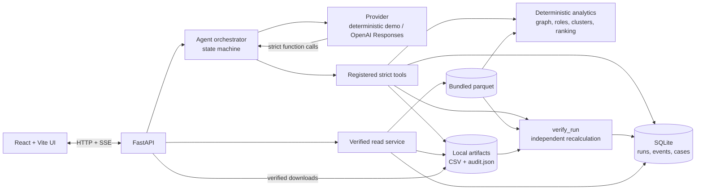

# Judge demo: от графа к проверяемому review case

## Архитектура



The provider chooses allowed tools; it does not calculate scores, assign roles, or declare verification passed. `verify_run` reloads the registered parquet and independently recalculates authoritative results before the run can complete. GIDs remain decimal strings in JSON and in the browser. The business action is a local review case with a verified export bundle; the result is a hypothesis for analyst review.

## Prepare before the 60–90 second walkthrough

From the repository root, start the API in demo mode. No OpenAI key is needed. The following PowerShell setup follows [README.md](../README.md); on macOS/Linux use its corresponding venv commands.

```powershell
py -3.12 -m venv .venv
.\.venv\Scripts\python.exe -m pip install -r backend\requirements.lock
.\.venv\Scripts\python.exe -m pip install --no-deps --no-build-isolation -e backend
.\.venv\Scripts\python.exe -m pip install -r backend\requirements-api.txt
.\.venv\Scripts\python.exe -m uvicorn backend.app.main:create_app --factory --host 127.0.0.1 --port 8000 --workers 1
```

In a second terminal:

```powershell
cd frontend
npm ci
npm run dev
```

Open <http://127.0.0.1:5173> and confirm **API connected**. Keep both processes running. If this workspace has an old demo run in the browser session, use **Reset demo** after that run finishes.

## 60–90 second walkthrough

| Time | Action and narration |
|---|---|
| 0–12 s | Show the landing view: “We begin with 81 seed clients and a four-hop transfer network. Our output is an analyst review hypothesis, not an accusation.” Click **Start bundled demo**. |
| 12–30 s | Point to **Run workflow** and the **Safe execution trace**. “The agent validates the bundled parquet, invokes controlled tools, computes deterministic evidence and ranks review targets. These are live backend steps, not a prerecorded UI sequence.” |
| 30–48 s | Wait for **Verified run complete**. Open **Review targets** and select the first row. In **Client evidence**, show the role, priority score, numeric rule evidence, and uncertainty flags. “Role match is rule strength, not probability of crime.” |
| 48–62 s | Close the drawer, scroll to **Network explorer**, choose a cluster and then a top GID. Show the directed graph and switch between **1 hop** and **2 hops**. “We limit the view to the relevant network slice.” |
| 62–78 s | In **From signal to action**, show **BEFORE** and **AFTER**: the local review case captures ranked targets. Point to **VERIFIED**. “Independent verification recalculates results before the case and exports are treated as complete.” |
| 78–90 s | Show **Evidence you can inspect**: `nodes_roles.csv`, `clusters.csv`, `top_nodes.csv`, and `audit.json`. Open or download an artifact. “The analyst gets a traceable queue and files for inspection.” |

If calculation takes longer than the allotted presentation window, wait for `status=completed` and `verification_status=passed` before showing the verified sections; target, graph, and download views are intentionally unavailable earlier. The run remains reproducible through the [HTTP API](API.md), starting with `POST /api/runs` body `{"dataset_id":"bundled","mode":"demo"}` followed by `POST /api/runs/{run_id}/execute`.

The bundled data omits identity, income, and ground truth. Depth-4 nodes with no visible outflow are boundary-limited, and seed inflow is incomplete. Do not present a role or priority score as guilt or a recommendation to block an account.
