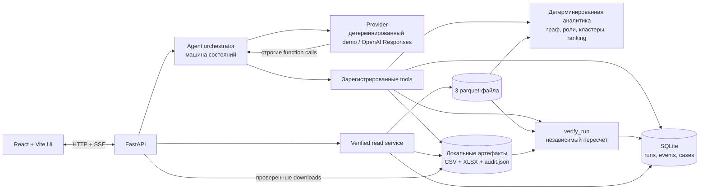

# Демо для жюри: от графа переводов к проверяемому AML case

## Схема решения



Provider выбирает только разрешённые tools. Он не рассчитывает scores, не назначает роли и не может самостоятельно объявить verification успешной. `verify_run` повторно читает исходные parquet и независимо пересчитывает authoritative результаты. В JSON и браузере GID остаются десятичными строками. Полезное действие агента — локальный review case с проверенным пакетом экспорта; результат является гипотезой для аналитика, а не обвинением.

## Подготовка перед показом

Рекомендуемый путь для жюри — одна команда из корня репозитория, без API-ключа:

```bash
docker compose up --build
```

Дождитесь healthy-статуса обоих сервисов и откройте <http://127.0.0.1:5173>. В верхней панели должно появиться **API connected**, а режим **Demo** должен быть выбран по умолчанию.

Если порты заняты, задайте их в локальном `.env`, например `BACKEND_PORT=18000` и `FRONTEND_PORT=15173`, после чего откройте frontend по новому порту. Для диагностики используйте:

```bash
docker compose ps
docker compose logs backend
docker compose logs frontend
```

Перед презентацией выполните один пробный run. Затем нажмите **Reset demo**, чтобы открыть чистое начальное состояние. Не используйте `docker compose down --volumes`, если хотите сохранить локальную историю и артефакты.

## Основной сценарий на 60–90 секунд

| Время | Действие и текст |
|---|---|
| 0–12 с | Покажите landing: «Мы начинаем с 81 известного seed-клиента и сети переводов на четыре колена. Результат — гипотеза для AML-проверки, а не обвинение». Нажмите **Start bundled demo**. |
| 12–30 с | Покажите **Run workflow** и **Safe execution trace**: «Агент проверяет parquet, выбирает контролируемые tools, рассчитывает evidence и формирует очередь проверки. Это настоящие backend-шаги, а не записанная анимация». |
| 30–48 с | Дождитесь **Verified run complete**. Откройте первую строку top-20 и покажите роль, priority score, конкретные значения evidence и uncertainty flags. |
| 48–62 с | Перейдите в **Network explorer**, выберите кластер и покажите направленный ego graph на один и два перехода. |
| 62–78 с | В блоке **From signal to action** покажите BEFORE/AFTER: агент создал локальный review case по top-20. Укажите badge **VERIFIED**. |
| 78–90 с | Скачайте `nodes_roles.csv`, `clusters.csv`, `top_nodes.csv` или `aml_review_report.xlsx`: «Файлы доступны только после независимой проверки». |

Если вычисление ещё идёт, не открывайте top-list и downloads до `status=completed` и `verification_status=passed`: backend специально закрывает непроверенные результаты.

## Расширенный разбор на пять минут

После основного сценария найдите через поиск GID три узла с разными структурными ролями:

| GID | Роль в ruleset v1 | Что показать |
|---|---|---|
| `100000003115284100` | `coordinator` | Пути от 11 seed, степени 8/2 и высокий bridge percentile; открыть 1-hop и 2-hop граф. |
| `100000008489922100` | `distributor` | Наблюдаемый fan-out на 36 получателей; направление исходящих рёбер. |
| `100000002398779100` | `consolidator` | 13 наблюдаемых плательщиков, низкая доля дальнейшего вывода и достижимость от 8 seed. |

Значения относятся к встроенному датасету и ruleset `v1`; перед выступлением сверяйте их с текущим top-list. Для каждого узла проговорите:

1. роль является силой совпадения с формальным правилом, а не вероятностью преступления;
2. evidence построен из наблюдаемых чисел;
3. неизвестные данные не достраиваются;
4. решение аналитика остаётся ручным.

Завершите показом `audit.json` и review case: так жюри видит полный путь `EVENT → TOOLS → ACTION → VERIFY`, а не только текст модели.

## Live mode с OpenAI

Golden path следует показывать в детерминированном demo mode: он не зависит от сети или внешнего API. Live mode является альтернативой и использует тот же набор tools.

Для него внесите ключ только в локальный игнорируемый `.env`:

```dotenv
DEMO_MODE=false
OPENAI_API_KEY=<ваш ключ>
OPENAI_MODEL=gpt-5-mini
```

Пересоберите приложение командой `docker compose up --build`, затем выберите **OpenAI live**. Никогда не показывайте содержимое `.env`, терминал с ключом или полный environment на демонстрации.

## Ограничения, которые нужно озвучить

- В данных нет ФИО, ИИН, дохода и ground truth.
- У узлов на `depth=4` дальнейшие переводы не наблюдаются из-за границы обхода.
- Входящий поток seed-клиентов неполон.
- Даты не содержат время внутри дня.
- Система создаёт очередь для аналитика, но не блокирует счета и не отправляет данные регулятору.
